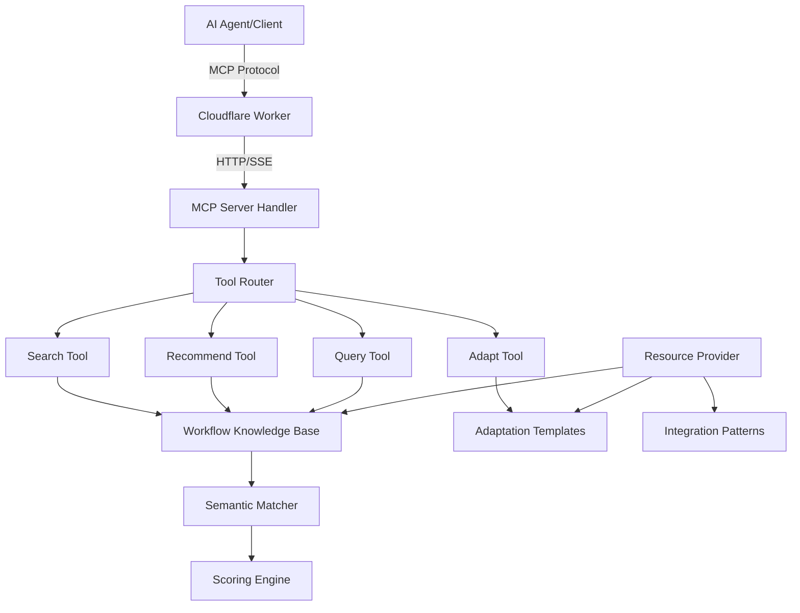

# MCP Server Implementation Plan for n8n Workflow Recommendation System

## Overview

This plan outlines the implementation of the n8n Workflow Recommendation System as a Model Context Protocol (MCP) server deployed on Cloudflare Workers. This will enable AI agents to access workflow recommendations, search capabilities, and adaptation guidance through a standardized protocol with global low-latency access.

## Architecture Overview



## MCP Server Components

### 1. MCP Tools (Actions AI Agents Can Perform)

#### Tool 1: `search_workflows`
**Purpose**: Search for workflow templates based on keywords, integrations, or use cases

**Input Schema**:
```typescript
{
  query: string;              // Search query
  integrations?: string[];    // Filter by integrations (e.g., ["Slack", "Google Sheets"])
  category?: string;          // Filter by category
  complexity?: "beginner" | "intermediate" | "advanced";
  limit?: number;             // Max results (default: 5)
}
```

**Output Schema**:
```typescript
{
  results: Array<{
    id: string;
    name: string;
    category: string;
    description: string;
    matchScore: number;       // 0-100
    integrations: string[];
    complexity: string;
    tags: string[];
    pattern: string;
  }>;
  totalResults: number;
  searchTime: number;
}
```

#### Tool 2: `recommend_workflow`
**Purpose**: Get intelligent workflow recommendations based on detailed requirements

**Input Schema**:
```typescript
{
  requirement: string;        // Detailed description of what user wants to automate
  services: string[];         // Services/integrations involved
  triggerType?: "webhook" | "schedule" | "manual" | "event";
  expectedOutcome?: string;   // What should happen
  constraints?: {
    budget?: "free" | "paid";
    technical?: "no-code" | "low-code" | "code-ok";
    performance?: "real-time" | "batch";
  };
}
```

**Output Schema**:
```typescript
{
  primaryRecommendation: {
    workflow: WorkflowTemplate;
    matchScore: number;
    matchReason: string;
    requiredIntegrations: string[];
    estimatedComplexity: string;
  };
  alternatives: Array<{
    workflow: WorkflowTemplate;
    matchScore: number;
    matchReason: string;
  }>;
  hybridApproach?: {
    description: string;
    combineWorkflows: string[];
  };
}
```

#### Tool 3: `get_adaptation_guide`
**Purpose**: Get step-by-step guidance for adapting a workflow template

**Input Schema**:
```typescript
{
  workflowId: string;
  customizations: {
    changeIntegrations?: Array<{
      from: string;
      to: string;
    }>;
    addFeatures?: string[];
    removeFeatures?: string[];
    changeTrigger?: string;
  };
}
```

**Output Schema**:
```typescript
{
  workflowId: string;
  adaptationSteps: Array<{
    step: number;
    action: "keep" | "modify" | "add" | "remove";
    component: string;
    instructions: string;
    codeExample?: string;
    configExample?: object;
  }>;
  estimatedDifficulty: string;
  prerequisites: string[];
  testingGuidance: string[];
}
```

#### Tool 4: `get_workflow_details`
**Purpose**: Get complete details about a specific workflow template

**Input Schema**:
```typescript
{
  workflowId: string;
  includeCode?: boolean;
  includeExamples?: boolean;
}
```

**Output Schema**:
```typescript
{
  workflow: WorkflowTemplate;
  nodeDetails: Array<{
    nodeName: string;
    nodeType: string;
    purpose: string;
    configuration: object;
    codeExample?: string;
  }>;
  useCaseExamples: string[];
  commonCustomizations: string[];
  relatedWorkflows: string[];
}
```

#### Tool 5: `get_integration_patterns`
**Purpose**: Get common patterns for specific integration combinations

**Input Schema**:
```typescript
{
  integrations: string[];     // e.g., ["Typeform", "Slack", "Google Sheets"]
  patternType?: "trigger-action" | "sync" | "notification" | "processing";
}
```

**Output Schema**:
```typescript
{
  patterns: Array<{
    name: string;
    description: string;
    structure: string;
    useCases: string[];
    exampleWorkflows: string[];
    codeSnippets: object;
  }>;
  bestPractices: string[];
  commonPitfalls: string[];
}
```

#### Tool 6: `validate_workflow_requirements`
**Purpose**: Validate if a workflow idea is feasible and suggest improvements

**Input Schema**:
```typescript
{
  description: string;
  requiredServices: string[];
  constraints?: object;
}
```

**Output Schema**:
```typescript
{
  feasible: boolean;
  issues: Array<{
    type: "missing-integration" | "incompatible" | "complex" | "rate-limit";
    description: string;
    suggestion: string;
  }>;
  improvements: string[];
  alternativeApproaches: string[];
}
```

### 2. MCP Resources (Data AI Agents Can Read)

#### Resource 1: `workflow://templates`
**Purpose**: Access to all workflow templates
**URI Pattern**: `workflow://templates/{category?}/{id?}`
**MIME Type**: `application/json`

#### Resource 2: `workflow://categories`
**Purpose**: List of all workflow categories with descriptions
**URI Pattern**: `workflow://categories`
**MIME Type**: `application/json`

#### Resource 3: `workflow://integrations`
**Purpose**: List of all supported integrations and their capabilities
**URI Pattern**: `workflow://integrations/{service?}`
**MIME Type**: `application/json`

#### Resource 4: `workflow://patterns`
**Purpose**: Common workflow patterns and structures
**URI Pattern**: `workflow://patterns/{pattern-type?}`
**MIME Type**: `application/json`

#### Resource 5: `workflow://adaptation-guides`
**Purpose**: Adaptation scenario guides
**URI Pattern**: `workflow://adaptation-guides/{scenario?}`
**MIME Type**: `application/json`

### 3. MCP Prompts (Reusable Prompt Templates)

#### Prompt 1: `workflow-recommendation`
**Purpose**: Guide AI to ask right questions for workflow recommendation
```
You are helping a user find the perfect n8n workflow template. Ask about:
1. What they want to automate
2. Which services/tools are involved
3. How it should be triggered
4. What the expected outcome is
5. Any constraints (budget, technical skill, performance)

Then use the recommend_workflow tool to find the best match.
```

#### Prompt 2: `workflow-adaptation`
**Purpose**: Guide AI through workflow customization
```
You are helping a user adapt an n8n workflow template. Guide them through:
1. Understanding the base workflow
2. Identifying what needs to change
3. Getting adaptation guidance
4. Implementing changes step-by-step
5. Testing the customized workflow

Use get_workflow_details and get_adaptation_guide tools.
```

#### Prompt 3: `workflow-troubleshooting`
**Purpose**: Help debug workflow issues
```
You are helping troubleshoot an n8n workflow. Ask about:
1. What's not working as expected
2. Error messages received
3. Which node is failing
4. What they've already tried

Then search for similar workflows and suggest solutions.
```

## Technical Implementation

### Cloudflare Worker Structure

```typescript
// src/index.ts
import { WorkerEntrypoint } from 'cloudflare:workers';
import { MCPServer } from '@modelcontextprotocol/sdk/server/index.js';
import { SSEServerTransport } from '@modelcontextprotocol/sdk/server/sse.js';

export default class N8nWorkflowMCPServer extends WorkerEntrypoint {
  async fetch(request: Request): Promise<Response> {
    const url = new URL(request.url);
    
    // Handle MCP endpoint
    if (url.pathname === '/mcp') {
      return this.handleMCP(request);
    }
    
    // Handle health check
    if (url.pathname === '/health') {
      return new Response(JSON.stringify({ status: 'healthy' }), {
        headers: { 'Content-Type': 'application/json' }
      });
    }
    
    return new Response('n8n Workflow MCP Server', { status: 200 });
  }
  
  async handleMCP(request: Request): Promise<Response> {
    const server = new MCPServer({
      name: 'n8n-workflow-recommender',
      version: '1.0.0',
    });
    
    // Register tools
    this.registerTools(server);
    
    // Register resources
    this.registerResources(server);
    
    // Register prompts
    this.registerPrompts(server);
    
    // Create SSE transport
    const transport = new SSEServerTransport('/mcp', request);
    
    // Connect server to transport
    await server.connect(transport);
    
    return transport.response;
  }
  
  registerTools(server: MCPServer) {
    // Tool implementations
  }
  
  registerResources(server: MCPServer) {
    // Resource implementations
  }
  
  registerPrompts(server: MCPServer) {
    // Prompt implementations
  }
}
```

### Data Storage Strategy

Since Cloudflare Workers have limitations, we'll use:

1. **KV Storage** for workflow templates (fast key-value access)
2. **D1 Database** for complex queries and relationships
3. **R2 Storage** for large adaptation guides and documentation
4. **In-Memory Cache** for frequently accessed data

```typescript
// Bindings in wrangler.toml
[[kv_namespaces]]
binding = "WORKFLOWS_KV"
id = "workflow-templates-kv"

[[d1_databases]]
binding = "WORKFLOWS_DB"
database_name = "n8n-workflows"
database_id = "workflow-db-id"

[[r2_buckets]]
binding = "GUIDES_BUCKET"
bucket_name = "adaptation-guides"
```

### Semantic Search Implementation

```typescript
// src/search/semantic-matcher.ts
export class SemanticMatcher {
  /**
   * Match user query against workflow templates
   */
  async match(query: string, filters: SearchFilters): Promise<SearchResult[]> {
    // 1. Tokenize and extract keywords
    const keywords = this.extractKeywords(query);
    
    // 2. Extract mentioned integrations
    const integrations = this.extractIntegrations(query);
    
    // 3. Identify workflow pattern
    const pattern = this.identifyPattern(query);
    
    // 4. Query database with filters
    const candidates = await this.queryCandidates(keywords, integrations, filters);
    
    // 5. Score each candidate
    const scored = candidates.map(workflow => ({
      workflow,
      score: this.calculateScore(workflow, {
        keywords,
        integrations,
        pattern,
        query
      })
    }));
    
    // 6. Sort by score and return top results
    return scored
      .sort((a, b) => b.score - a.score)
      .slice(0, filters.limit || 5);
  }
  
  calculateScore(workflow: Workflow, context: MatchContext): number {
    let score = 0;
    
    // Integration match (40%)
    const integrationMatch = this.scoreIntegrationMatch(
      workflow.integrations,
      context.integrations
    );
    score += integrationMatch * 0.4;
    
    // Use case similarity (30%)
    const useCaseMatch = this.scoreUseCaseSimilarity(
      workflow.useCases,
      context.query
    );
    score += useCaseMatch * 0.3;
    
    // Pattern match (20%)
    const patternMatch = this.scorePatternMatch(
      workflow.pattern,
      context.pattern
    );
    score += patternMatch * 0.2;
    
    // Keyword match (10%)
    const keywordMatch = this.scoreKeywordMatch(
      workflow.tags,
      context.keywords
    );
    score += keywordMatch * 0.1;
    
    return score * 100; // Return 0-100 score
  }
}
```

### Recommendation Engine

```typescript
// src/recommendation/engine.ts
export class RecommendationEngine {
  async recommend(requirements: WorkflowRequirements): Promise<Recommendation> {
    // 1. Parse requirements
    const parsed = this.parseRequirements(requirements);
    
    // 2. Search for matches
    const matches = await this.semanticMatcher.match(
      parsed.query,
      parsed.filters
    );
    
    // 3. Select primary recommendation
    const primary = matches[0];
    
    // 4. Generate match reason
    const matchReason = this.generateMatchReason(primary, parsed);
    
    // 5. Find alternatives
    const alternatives = matches.slice(1, 4);
    
    // 6. Check for hybrid approach
    const hybrid = this.checkHybridApproach(matches, parsed);
    
    return {
      primaryRecommendation: {
        workflow: primary.workflow,
        matchScore: primary.score,
        matchReason,
        requiredIntegrations: primary.workflow.integrations,
        estimatedComplexity: primary.workflow.complexity
      },
      alternatives: alternatives.map(alt => ({
        workflow: alt.workflow,
        matchScore: alt.score,
        matchReason: this.generateMatchReason(alt, parsed)
      })),
      hybridApproach: hybrid
    };
  }
}
```

### Adaptation Guide Generator

```typescript
// src/adaptation/guide-generator.ts
export class AdaptationGuideGenerator {
  async generate(
    workflowId: string,
    customizations: Customizations
  ): Promise<AdaptationGuide> {
    // 1. Load workflow template
    const workflow = await this.loadWorkflow(workflowId);
    
    // 2. Analyze customizations
    const changes = this.analyzeChanges(workflow, customizations);
    
    // 3. Generate step-by-step instructions
    const steps = this.generateSteps(workflow, changes);
    
    // 4. Add code examples
    const stepsWithCode = await this.addCodeExamples(steps);
    
    // 5. Estimate difficulty
    const difficulty = this.estimateDifficulty(changes);
    
    // 6. Generate testing guidance
    const testing = this.generateTestingGuidance(workflow, changes);
    
    return {
      workflowId,
      adaptationSteps: stepsWithCode,
      estimatedDifficulty: difficulty,
      prerequisites: this.getPrerequisites(workflow, changes),
      testingGuidance: testing
    };
  }
}
```

## Deployment Configuration

### wrangler.toml

```toml
name = "n8n-workflow-mcp-server"
main = "src/index.ts"
compatibility_date = "2024-01-01"
compatibility_flags = ["nodejs_compat"]

[observability]
enabled = true

[[kv_namespaces]]
binding = "WORKFLOWS_KV"
id = "your-kv-namespace-id"

[[d1_databases]]
binding = "WORKFLOWS_DB"
database_name = "n8n-workflows"
database_id = "your-d1-database-id"

[[r2_buckets]]
binding = "GUIDES_BUCKET"
bucket_name = "adaptation-guides"

[vars]
ENVIRONMENT = "production"
LOG_LEVEL = "info"

# Rate limiting
[limits]
cpu_ms = 50
```

### package.json

```json
{
  "name": "n8n-workflow-mcp-server",
  "version": "1.0.0",
  "type": "module",
  "scripts": {
    "dev": "wrangler dev",
    "deploy": "wrangler deploy",
    "test": "vitest",
    "seed": "node scripts/seed-data.js"
  },
  "dependencies": {
    "@modelcontextprotocol/sdk": "^1.0.0",
    "@cloudflare/workers-types": "^4.0.0"
  },
  "devDependencies": {
    "wrangler": "^3.0.0",
    "typescript": "^5.0.0",
    "vitest": "^1.0.0"
  }
}
```

## Data Seeding Strategy

### Workflow Templates in KV

```typescript
// scripts/seed-workflows.ts
import workflows from '../data/workflows.json';

async function seedWorkflows(env: Env) {
  for (const workflow of workflows) {
    // Store full workflow
    await env.WORKFLOWS_KV.put(
      `workflow:${workflow.id}`,
      JSON.stringify(workflow)
    );
    
    // Store in category index
    const categoryKey = `category:${workflow.category}`;
    const categoryWorkflows = JSON.parse(
      await env.WORKFLOWS_KV.get(categoryKey) || '[]'
    );
    categoryWorkflows.push(workflow.id);
    await env.WORKFLOWS_KV.put(categoryKey, JSON.stringify(categoryWorkflows));
    
    // Store in integration indexes
    for (const integration of workflow.integrations) {
      const integrationKey = `integration:${integration}`;
      const integrationWorkflows = JSON.parse(
        await env.WORKFLOWS_KV.get(integrationKey) || '[]'
      );
      integrationWorkflows.push(workflow.id);
      await env.WORKFLOWS_KV.put(
        integrationKey,
        JSON.stringify(integrationWorkflows)
      );
    }
  }
}
```

### Search Index in D1

```sql
-- schema.sql
CREATE TABLE workflows (
  id TEXT PRIMARY KEY,
  name TEXT NOT NULL,
  category TEXT NOT NULL,
  description TEXT NOT NULL,
  complexity TEXT NOT NULL,
  pattern TEXT NOT NULL,
  created_at DATETIME DEFAULT CURRENT_TIMESTAMP
);

CREATE TABLE workflow_integrations (
  workflow_id TEXT NOT NULL,
  integration TEXT NOT NULL,
  PRIMARY KEY (workflow_id, integration),
  FOREIGN KEY (workflow_id) REFERENCES workflows(id)
);

CREATE TABLE workflow_tags (
  workflow_id TEXT NOT NULL,
  tag TEXT NOT NULL,
  PRIMARY KEY (workflow_id, tag),
  FOREIGN KEY (workflow_id) REFERENCES workflows(id)
);

CREATE TABLE workflow_use_cases (
  workflow_id TEXT NOT NULL,
  use_case TEXT NOT NULL,
  PRIMARY KEY (workflow_id, use_case),
  FOREIGN KEY (workflow_id) REFERENCES workflows(id)
);

-- Indexes for fast searching
CREATE INDEX idx_workflows_category ON workflows(category);
CREATE INDEX idx_workflows_complexity ON workflows(complexity);
CREATE INDEX idx_workflow_integrations_integration ON workflow_integrations(integration);
CREATE INDEX idx_workflow_tags_tag ON workflow_tags(tag);

-- Full-text search
CREATE VIRTUAL TABLE workflows_fts USING fts5(
  id,
  name,
  description,
  content='workflows',
  content_rowid='rowid'
);
```

## API Response Examples

### Example 1: Search Workflows

**Request**:
```json
{
  "method": "tools/call",
  "params": {
    "name": "search_workflows",
    "arguments": {
      "query": "sync typeform to google sheets",
      "limit": 3
    }
  }
}
```

**Response**:
```json
{
  "results": [
    {
      "id": "marketing-typeform-email-001",
      "name": "Typeform to Email Campaign",
      "category": "Marketing Automation",
      "description": "Automatically add Typeform respondents to email marketing campaigns",
      "matchScore": 85,
      "integrations": ["Typeform", "Google Sheets", "Mailchimp"],
      "complexity": "beginner",
      "tags": ["typeform", "google-sheets", "sync"],
      "pattern": "Trigger → Conditional → Action → Store"
    }
  ],
  "totalResults": 1,
  "searchTime": 45
}
```

### Example 2: Recommend Workflow

**Request**:
```json
{
  "method": "tools/call",
  "params": {
    "name": "recommend_workflow",
    "arguments": {
      "requirement": "I need to capture form submissions and notify my team in Slack",
      "services": ["Typeform", "Slack"],
      "triggerType": "webhook"
    }
  }
}
```

**Response**:
```json
{
  "primaryRecommendation": {
    "workflow": {
      "id": "marketing-typeform-email-001",
      "name": "Typeform to Slack Notification"
    },
    "matchScore": 95,
    "matchReason": "Perfect match: Uses Typeform webhook trigger and Slack notification. Includes data formatting and error handling.",
    "requiredIntegrations": ["Typeform", "Slack"],
    "estimatedComplexity": "beginner"
  },
  "alternatives": [
    {
      "workflow": {
        "id": "support-email-ticket-001",
        "name": "Form to Ticket System"
      },
      "matchScore": 70,
      "matchReason": "Similar pattern but includes ticketing system"
    }
  ]
}
```

## Performance Optimization

### Caching Strategy

```typescript
// src/cache/strategy.ts
export class CacheStrategy {
  // Cache frequently accessed workflows
  private workflowCache = new Map<string, Workflow>();
  
  // Cache search results (5 minutes TTL)
  private searchCache = new Map<string, CachedSearch>();
  
  async getWorkflow(id: string, env: Env): Promise<Workflow> {
    // Check memory cache
    if (this.workflowCache.has(id)) {
      return this.workflowCache.get(id)!;
    }
    
    // Check KV
    const cached = await env.WORKFLOWS_KV.get(`workflow:${id}`);
    if (cached) {
      const workflow = JSON.parse(cached);
      this.workflowCache.set(id, workflow);
      return workflow;
    }
    
    throw new Error(`Workflow ${id} not found`);
  }
  
  async cacheSearchResults(query: string, results: SearchResult[]) {
    const cacheKey = this.generateCacheKey(query);
    this.searchCache.set(cacheKey, {
      results,
      timestamp: Date.now(),
      ttl: 5 * 60 * 1000 // 5 minutes
    });
  }
}
```

### Rate Limiting

```typescript
// src/middleware/rate-limit.ts
export class RateLimiter {
  async checkLimit(clientId: string, env: Env): Promise<boolean> {
    const key = `ratelimit:${clientId}`;
    const current = await env.WORKFLOWS_KV.get(key);
    
    if (!current) {
      await env.WORKFLOWS_KV.put(key, '1', { expirationTtl: 60 });
      return true;
    }
    
    const count = parseInt(current);
    if (count >= 100) { // 100 requests per minute
      return false;
    }
    
    await env.WORKFLOWS_KV.put(key, String(count + 1), { expirationTtl: 60 });
    return true;
  }
}
```

## Testing Strategy

### Unit Tests

```typescript
// tests/search.test.ts
import { describe, it, expect } from 'vitest';
import { SemanticMatcher } from '../src/search/semantic-matcher';

describe('SemanticMatcher', () => {
  it('should match workflows by integration', async () => {
    const matcher = new SemanticMatcher();
    const results = await matcher.match('typeform slack', {});
    
    expect(results.length).toBeGreaterThan(0);
    expect(results[0].workflow.integrations).toContain('Typeform');
  });
  
  it('should score exact matches higher', async () => {
    const matcher = new SemanticMatcher();
    const results = await matcher.match('typeform to google sheets', {});
    
    expect(results[0].score).toBeGreaterThan(80);
  });
});
```

### Integration Tests

```typescript
// tests/mcp-server.test.ts
import { describe, it, expect } from 'vitest';
import { MCPClient } from '@modelcontextprotocol/sdk/client/index.js';

describe('MCP Server', () => {
  it('should list available tools', async () => {
    const client = new MCPClient();
    await client.connect('http://localhost:8787/mcp');
    
    const tools = await client.listTools();
    
    expect(tools).toContainEqual(
      expect.objectContaining({ name: 'search_workflows' })
    );
  });
  
  it('should execute search_workflows tool', async () => {
    const client = new MCPClient();
    await client.connect('http://localhost:8787/mcp');
    
    const result = await client.callTool('search_workflows', {
      query: 'slack notification'
    });
    
    expect(result.results).toBeDefined();
    expect(result.results.length).toBeGreaterThan(0);
  });
});
```

## Monitoring and Observability

### Logging

```typescript
// src/utils/logger.ts
export class Logger {
  constructor(private env: Env) {}
  
  info(message: string, data?: object) {
    console.log(JSON.stringify({
      level: 'info',
      message,
      data,
      timestamp: new Date().toISOString()
    }));
  }
  
  error(message: string, error: Error) {
    console.error(JSON.stringify({
      level: 'error',
      message,
      error: {
        message: error.message,
        stack: error.stack
      },
      timestamp: new Date().toISOString()
    }));
  }
  
  async logToolCall(toolName: string, duration: number, success: boolean) {
    // Log to analytics
    await this.env.WORKFLOWS_KV.put(
      `metrics:tool:${toolName}:${Date.now()}`,
      JSON.stringify({ duration, success }),
      { expirationTtl: 86400 } // 24 hours
    );
  }
}
```

### Metrics

```typescript
// src/utils/metrics.ts
export class Metrics {
  async recordToolUsage(toolName: string, env: Env) {
    const key = `metrics:usage:${toolName}`;
    const current = await env.WORKFLOWS_KV.get(key) || '0';
    await env.WORKFLOWS_KV.put(key, String(parseInt(current) + 1));
  }
  
  async recordSearchLatency(latency: number, env: Env) {
    const key = `metrics:latency:search:${Date.now()}`;
    await env.WORKFLOWS_KV.put(key, String(latency), {
      expirationTtl: 3600 // 1 hour
    });
  }
}
```

## Client Integration Examples

### Claude Desktop Integration

```json
{
  "mcpServers": {
    "n8n-workflows": {
      "url": "https://n8n-workflow-mcp.your-subdomain.workers.dev/mcp",
      "transport": "sse"
    }
  }
}
```

### Cursor Integration

```json
{
  "mcp": {
    "servers": {
      "n8n-workflows": {
        "command": "curl",
        "args": [
          "-N",
          "https://n8n-workflow-mcp.your-subdomain.workers.dev/mcp"
        ]
      }
    }
  }
}
```

### Custom Client Example

```typescript
import { Client } from '@modelcontextprotocol/sdk/client/index.js';
import { SSEClientTransport } from '@modelcontextprotocol/sdk/client/sse.js';

const client = new Client({
  name: 'my-app',
  version: '1.0.0'
});

const transport = new SSEClientTransport(
  new URL('https://n8n-workflow-mcp.your-subdomain.workers.dev/mcp')
);

await client.connect(transport);

// Search for workflows
const results = await client.callTool('search_workflows', {
  query: 'slack notification',
  limit: 5
});

console.log(results);
```

## Security Considerations

### Authentication

```typescript
// src/middleware/auth.ts
export class AuthMiddleware {
  async authenticate(request: Request, env: Env): Promise<boolean> {
    const authHeader = request.headers.get('Authorization');
    
    if (!authHeader) {
      return false;
    }
    
    const token = authHeader.replace('Bearer ', '');
    
    // Validate token against KV store
    const validToken = await env.WORKFLOWS_KV.get(`token:${token}`);
    
    return validToken !== null;
  }
}
```

### Input Validation

```typescript
// src/validation/schemas.ts
import { z } from 'zod';

export const SearchWorkflowsSchema = z.object({
  query: z.string().min(1).max(500),
  integrations: z.array(z.string()).optional(),
  category: z.string().optional(),
  complexity: z.enum(['beginner', 'intermediate', 'advanced']).optional(),
  limit: z.number().min(1).max(20).optional()
});

export function validateInput<T>(schema: z.Schema<T>, input: unknown): T {
  return schema.parse(input);
}
```

## Deployment Checklist

- [ ] Set up Cloudflare account and Workers
- [ ] Create KV namespace for workflows
- [ ] Create D1 database for search
- [ ] Create R2 bucket for guides
- [ ] Configure wrangler.toml with bindings
- [ ] Seed workflow data to KV and D1
- [ ] Deploy worker to Cloudflare
- [ ] Test MCP endpoints
- [ ] Configure custom domain (optional)
- [ ] Set up monitoring and alerts
- [ ] Document API for users
- [ ] Create client integration examples

## Next Steps

1. **Phase 1**: Implement core MCP server structure
2. **Phase 2**: Implement search and recommendation tools
3. **Phase 3**: Add adaptation guide generation
4. **Phase 4**: Set up data storage and seeding
5. **Phase 5**: Deploy to Cloudflare Workers
6. **Phase 6**: Test with AI clients
7. **Phase 7**: Optimize performance and add monitoring
8. **Phase 8**: Document and release

## Success Metrics

- **Response Time**: < 50ms for tool calls
- **Availability**: 99.9% uptime
- **Accuracy**: > 85% match score for recommendations
- **Usage**: Track tool call frequency
- **Satisfaction**: Gather feedback from AI agents/users

## Resources

- **MCP SDK**: https://github.com/modelcontextprotocol/sdk
- **Cloudflare Workers**: https://developers.cloudflare.com/workers/
- **Wrangler CLI**: https://developers.cloudflare.com/workers/wrangler/
- **MCP Specification**: https://spec.modelcontextprotocol.io/
